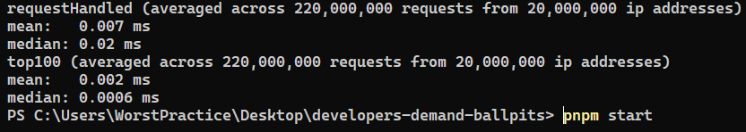
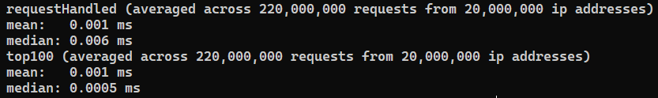

# developers-demand-ballpits

A fun and interesting programming challenge solved in TypeScript.

## Where do I look?

The meat and potatoes of this thing is located in the `challengeSolution.ts` file.

Oh, and you can absolutely read this on GitHub. But the comments render quite nicely in VsCode (your milage may vary for other IDEs).

So the viewing experience is almost certainly best if you just clone the repo and start poking around in it like you would in real code.

## And where can I find the discussion?

Wherever you find the code, in fact. I decided to socratically sprinkle the discussion across the various parts of the source code.

I'm a huge fan of the conversational writing style of esteemed programming communicators like [Gary Bernhardt](https://www.destroyallsoftware.com/screencasts), [Amos](https://fasterthanli.me/series/reading-files-the-hard-way/part-1) and [Eli Bendersky](https://eli.thegreenplace.net/2018/launching-linux-threads-and-processes-with-clone/) (to name just a few).

I will clarify however that normal code should never be documented like this. It isn't really documentation, per se.

Nor is it meant to be. Just like this exercise isn't an example of normal coding, either.

On the contrary, the exercise fills a purpose all its own — as does the text.

## Speaking of which, where is the part on testing?

In a nutshell, if I was stranded on a desert island and could only pick one way to test a project like this (imagining the bigger API that this challenge references in its description), I'd probably pick E2E testing and then begin arranging coconuts on the beach to spell out H-E-L-P in huge letters.

If we test E2E and every aspect of the product is reachable from the tests (which should map as closely as possible to the perspective of the users) and every feature simply works, then that pretty much has to mean the operative parts of the backend, frontend, integration, network (etc) work. That's a pretty airtight definition of "works".

On a smaller scale, for code of the kind written here though, I'd probably say property-based testing. Property-based testing is amazingly well adapted for code of this nature, where we have a range of inputs and we essentially want to fuzz all aspects of the implementation, and especially find minimal reproducible edge cases automatically.

## Great stuff, and the rest?

You'll find it in the various files, hopefully as part of a discussion that makes sense. I suspect quite a few places may seem to contain non-sequitours, but that's a risk I'm willing to accept in trying to adopt a conversational style.

My hope is that my words will inspire curiosity in you about the code and how it all fits together, your brain not knowing quite what to expect, which should hopefully help to promote wakefulness, at the very least.

I did my very best to hit all of the points of discussion specified in the original problem formulation. If I missed something, please let me know and I'll gladly elaborate further.

## Is there any more cool trivia?

Yes! I ran the numbers myself on my own machine (which is significantly weaker than any server rig, or should I say container fleet, scaled to meet 20 million clients a day).

The deadline for the top100 function was being able to return a correct answer at any point in the program in under 300 milliseconds.

I ran it once for every request that trickled in, just to make things as hard as possible.

I also made each IP send multiple requests, 10 in the benchmarks discussed below.

~~`requestHandled` took 70 microseconds (mean) and a whopping 200 microseconds (median) to run.~~

~~`top100` did better, taking 20 microseconds (mean) and 6 microseconds (median) to run.~~

~~The good news are, even 200 microseconds is well within the range of 300 milliseconds.~~

Thanks to your steely wise and eagle-eyed engineering department, an unexploited branch in the code was identified, in which sorting the top 100 list proved unnecessary.

This especially matters since this particular branch is very hot — in other words, it ends up being taken incredibly often.

With this discovery pumped dry for all its performance savings, the new numbers are as follows:

`requestHandled` sped up by 700% (mean) and ~350% (median).

`top100` sped up by 200% (mean) and 20% (median).

## Is the code that runs intended as part of your submission?

Thank you for asking! No, it is in fact not intended as part of the challenge.

It's just there because I couldn't help myself but implement this project in a profile-guided manner.

And I expect you fine people to be as unabashedly nerdy as myself, and likely pretty curious to see how it runs anyways.

So I included that (just as trivia).

## And how would one go about running it? (Asking for a friend)

- Have Node.js, preferably the latest non-LTS version (17.9.0 as of this writing)
- Have the PNPM package manager installed (if you don't, run npm -g install pnpm)
- Run pnpm i && pnpm start
